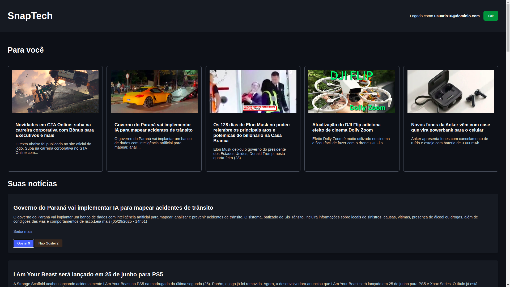

# SNAPTECH API

- Desafio da Pós Tech em Machine Learning Engineering
    - API de recomendação de notícias de tecnologia

- Entregas:
    - API de coleta de dados em tempo real da newsdata.io, armazenado em SQLite 
    - Modelo de ML, Sistema de Recomendação baseado em Matriz de Similaridade
        - Um segundo modelo em KMeans de clusters
    - Alimenta uma aplicação simples, um site de notícias tech, Front-end

## API NEWS
https://newsdata.io/dashboard

- Front-end
    - https://github.com/euclidesfreire/snaptech-front

## Executar

- Criar venv
    - python -m venv venv

- Entrar na venv
    - Linux
        - source venv/bin/activate

    - Windows
        - venv\Scripts\activate

- Instalar bibliotecas 
    - pip install -r requirements.txt

- Executar fast-api
    - uvicorn main:app --reload

## Artigos

- Dados
    - você pode usar o news.db ou news-copy.db já salvos
    - Ou carregar da API News Data
        - /fetch/latest
        - Se recarregar os artigos, em seguida precisa startar os dados de exemplos
            - /start/

- Algoritmos de Recomendação
    - ml/recommender.py

    - Para executar
        - Cold-start
            - /recommendations/cold_start
        - Matrix de similaridade (precisa do email via post)
            - /recommendations/